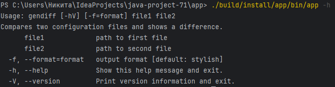
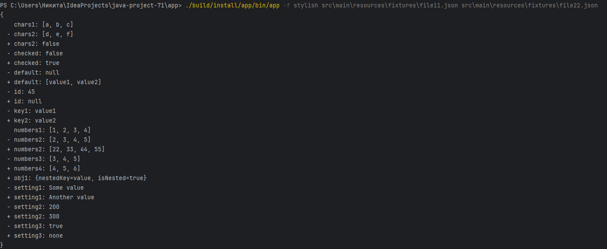
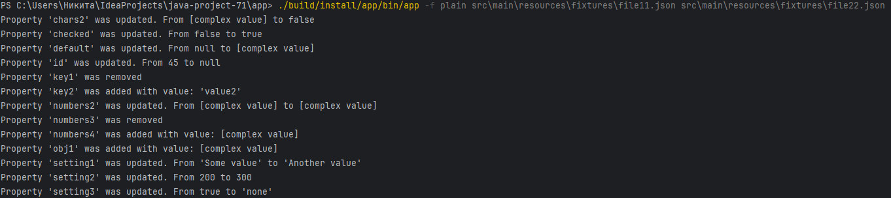
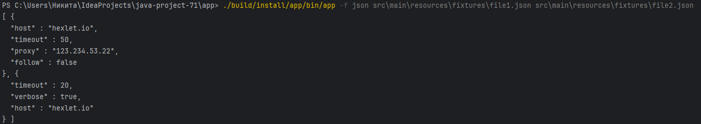

### Hexlet tests and linter status:

##### Отображение справки по программе:

#### Вывод результата сравнения в формате 'Stylish' (формат по умолчанию):

#### Вывод результата сравнения в формате 'Plain'

#### Вывод результата сравнения в формате 'Json'

